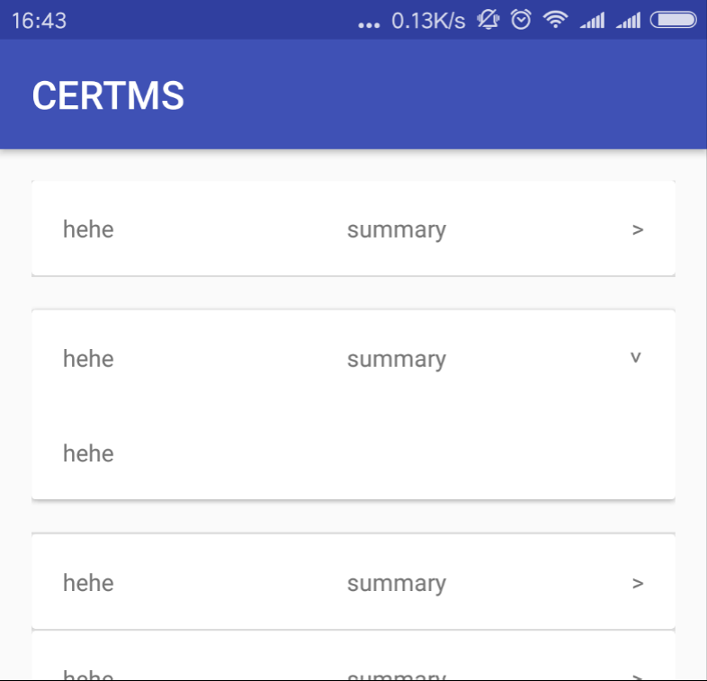

# LuCardView
##简介咯
这是一个可扩展的CardView。先上一个效果图。

这个CardView分为上下两部分，上部分为Title部分，包括一个Title和一个Summary字符串和一个箭头。

下部分则是Content部分。

通过点击Title部分可以展开和关闭CardView并与上下产生一个margin值。

##使用方法
下载aar/luCardView.aar,在Android Studio中导入就行了...

```xml
    <com.beginlu.lucardview.LuCardView
        android:layout_width="match_parent"
        android:layout_height="wrap_content"
        app:summary="summary"
        app:title="title">

        <RelativeLayout
            android:layout_width="wrap_content"
            android:layout_height="wrap_content"
            android:padding="@dimen/activity_horizontal_margin">

            <TextView
                android:layout_width="wrap_content"
                android:layout_height="wrap_content"
                android:text="content" />
        </RelativeLayout>
    </com.beginlu.lucardview.LuCardView>
```
##注意事项
没啥好注意的，就是希望有遇到bug或者想吐槽什么的尽管和我说
- 我还是说下好了...子布局只能有一个，所以，放ViewGroup吧，别问我为什么，因为太多了太难计算Content的高度，我下次看能不能解决这个问题。

##更新日志
2017-3-1
- 修复了Content内容为空时CardView无法展示的问题
- 为打开动画添加End监听，动画结束后修改Content高度为WRAP_CONTENT
- 可以嵌套CardView了

##PS
展示发现了一些Bug，待解决。

- ~~Content内容为空时CardView无法展示(划掉)~~
- 箭头是文字的>太丑了
- 父布局必须为RelativeLayout